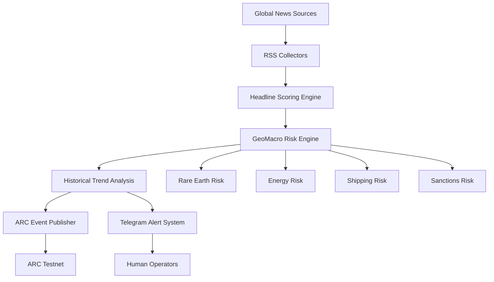

# GeoMacro Oracle


**ARC Agent ID:** 39369

GeoMacro Oracle is an autonomous geopolitical intelligence agent designed to transform real world events into machine readable risk signals.

Built for ARC Testnet, the system continuously monitors geopolitical conflicts, sanctions, energy markets, shipping disruptions and strategic supply chains to identify emerging global risks before they propagate through markets.

---

## Mission

Financial markets react to geopolitical reality.

GeoMacro Oracle attempts to quantify that reality.

The agent converts global events into structured intelligence that can be consumed by:

* Autonomous agents
* Prediction markets
* DAOs
* Treasury managers
* Macro researchers
* Onchain risk systems

---

## Current Capabilities

### Intelligence Collection

* Live multi-source news ingestion
* Geopolitical event monitoring
* Energy market monitoring
* Shipping disruption monitoring
* Rare-earth supply chain monitoring
* Sanctions monitoring

### Risk Analysis

* Event classification
* Dynamic risk scoring
* Global Risk Index generation
* Trend detection
* Regime-shift identification

### Autonomous Actions

* ARC event publishing
* Historical memory storage
* Telegram intelligence alerts
* Continuous monitoring mode

---

## Architecture



---

## Data Sources

* BBC World
* New York Times World
* Al Jazeera
* Additional geopolitical RSS feeds

---

## Example Output

Global Risk: 60

Headline:
Israel strikes Beirut suburb days after US-brokered truce

Trend:
Stable

Drivers:
military_action, middle_east

Confidence:
100%

---
## Why It Matters

Most markets react to geopolitical events only after narratives become widely visible.

GeoMacro Oracle attempts to identify risk signals earlier by continuously monitoring conflicts, sanctions, energy disruptions, shipping bottlenecks and strategic supply chains.

The objective is to convert geopolitical complexity into structured machine-readable intelligence that autonomous systems can act upon.

## Vision

GeoMacro Oracle is evolving into an autonomous geopolitical forecasting network.

Future versions will:

* Generate geopolitical hypotheses
* Forecast escalation probabilities
* Track geopolitical narratives
* Create machine-readable macro theses
* Integrate with prediction markets
* Power autonomous risk economies

The long-term objective is to build an Autonomous Geopolitical Intelligence Layer for Web3.

---

## Installation

```bash
npm install
```

## Run

```bash
npm run start
```

## Watch Mode

```bash
npm run watcher
```

---

## ARC

Agent ID: 39369

Project: GeoMacro Oracle

## Roadmap

### Phase 1 — Intelligence Collection
- [x] Multi-source news ingestion
- [x] Event classification
- [x] Global risk scoring
- [x] ARC event publishing
- [x] Telegram alerts

### Phase 2 — Intelligence Memory
- [x] Historical trend tracking
- [ ] Regime-shift detection
- [ ] Narrative persistence

### Phase 3 — Forecasting
- [ ] Escalation probability engine
- [ ] Geopolitical scenario generation
- [ ] Strategic risk forecasting

### Phase 4 — Prediction Markets
- [ ] Geopolitical market creation
- [ ] Event probability pricing
- [ ] Market settlement logic

### Phase 5 — Autonomous Intelligence Network
- [ ] Multi-agent forecasting
- [ ] Agent reputation layer
- [ ] Onchain geopolitical intelligence economy

Built for ARC Testnet.
