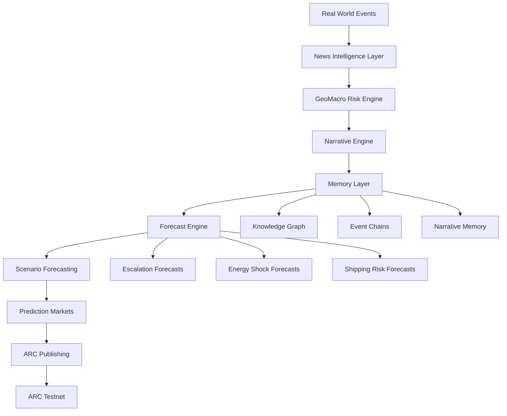

# GeoMacro Oracle


**ARC Agent ID:** 39369

### From Real-World Events to Machine-Readable Intelligence

GeoMacro Oracle is an autonomous geopolitical intelligence agent designed to transform real world events into machine readable risk signals.

Built for ARC Testnet, the system continuously monitors geopolitical conflicts, sanctions, energy markets, shipping disruptions and strategic supply chains to identify emerging global risks before they propagate through markets.

---

## Mission

Financial markets react to geopolitical reality.

GeoMacro Oracle attempts to quantify that reality.

The agent converts global events into structured intelligence that can be consumed by:

* Autonomous agents
* Prediction markets
* DAOs
* Treasury managers
* Macro researchers
* Onchain risk systems

---

## Current Capabilities

### Intelligence Collection

* Live multi-source news ingestion
* Geopolitical event monitoring
* Energy market monitoring
* Shipping disruption monitoring
* Rare-earth supply chain monitoring
* Sanctions monitoring

### Risk Analysis

* Event classification
* Dynamic risk scoring
* Global Risk Index generation
* Trend detection
* Regime-shift identification

### Autonomous Actions

* ARC event publishing
* Historical memory storage
* Telegram intelligence alerts
* Continuous monitoring mode

### Forecasting Layer

* Narrative Detection Engine
* Narrative State Engine
* Scenario Generation
* Escalation Forecasting
* Strategic Risk Forecasting

### Intelligence Memory

* Narrative Memory
* Event Chain Tracking
* Historical Risk Memory
* Knowledge Graph Construction

### Prediction Markets

* Automated Market Generation
* Escalation Probability Markets
* Energy Shock Markets
* Shipping Disruption Markets
* Sanctions Forecast Markets

---

## Architecture



### Intelligence Flow

```text
Real World Events
        ↓
GeoMacro Oracle
        ↓
Forecast Layer
        ↓
Prediction Markets
        ↓
ARC Agents
        ↓
Onchain Capital Allocation
```

## Data Sources

* BBC World
* New York Times World
* Al Jazeera
* Additional geopolitical RSS feeds

---

## Example Output

```json
{
  "globalRisk": 59,
  "headline": "Iran and Israel say they will pause strikes but warn of retaliation if ceasefire breached again",
  "narrative": "Iran-Israel Escalation",
  "stage": "Fragile Ceasefire",
  "escalationProbability": 70,
  "energyShockProbability": 25,
  "trend": "Stable",
  "confidence": 85
}
```
## Why It Matters

Markets do not move because news exists.

Markets move because narratives, risks and expectations change.

Most geopolitical monitoring systems describe events after they become obvious.

GeoMacro Oracle attempts to identify emerging geopolitical risk before it becomes fully priced into markets.

By continuously monitoring conflicts, sanctions, energy disruptions, shipping bottlenecks and strategic supply chains, the system transforms geopolitical complexity into machine-readable intelligence that autonomous agents, prediction markets and onchain systems can act upon.


## What Makes GeoMacro Oracle Different

Most geopolitical monitoring systems describe what happened.

GeoMacro Oracle attempts to estimate:

* What happens next
* How likely it is
* Which geopolitical narrative is forming
* Which strategic regime is emerging
* Which prediction markets should exist

The objective is not information delivery.

The objective is machine-readable geopolitical intelligence.

## Vision

GeoMacro Oracle is evolving into an autonomous geopolitical forecasting network.

Future versions will:

* Generate geopolitical hypotheses
* Forecast escalation probabilities
* Track geopolitical narratives
* Create machine-readable macro theses
* Integrate with prediction markets
* Power autonomous risk economies

The long-term objective is to build an Autonomous Geopolitical Intelligence Layer for Web3.

## End State

```text
Real World Events
        ↓
GeoMacro Oracle
        ↓
Forecast Layer
        ↓
Prediction Markets
        ↓
ARC Agents
        ↓
Onchain Capital Allocation
```

---

## Installation

```bash
npm install
```

## Run

```bash
npm run start
```

## Watch Mode

```bash
npm run watcher
```

---

## ARC

Agent ID: 39369

Project: GeoMacro Oracle

## Roadmap

### Phase 1 — Intelligence Collection
- [x] Multi-source news ingestion
- [x] Event classification
- [x] Global risk scoring
- [x] ARC event publishing
- [x] Telegram alerts

### Phase 2 — Intelligence Memory
- [x] Historical trend tracking
- [x] Narrative persistence
- [x] Event memory
- [x] Knowledge graph

### Phase 3 — Forecasting
- [x] Escalation probability engine
- [x] Geopolitical scenario generation
- [x] Strategic risk forecasting
- [ ] Forecast accuracy engine
- [ ] Multi-scenario forecasting

### Phase 4 — Prediction Markets
- [x] Geopolitical market creation
- [ ] Event probability pricing
- [ ] Market settlement logic

### Phase 5 — Autonomous Intelligence Network
- [ ] Multi-agent forecasting
- [ ] Agent reputation layer
- [ ] Onchain geopolitical intelligence economy

Built for ARC Testnet.
